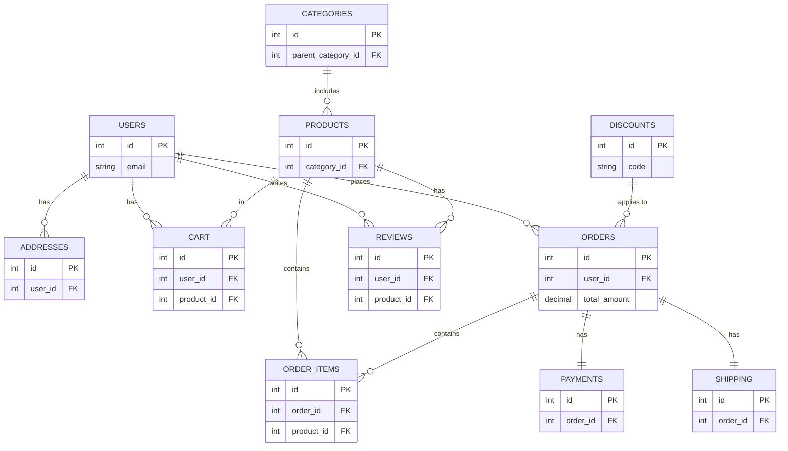

# E-commerce Database Schema

This document describes the database schema for an e-commerce application. It includes the table list, detailed schema information, constraints, relationship overview, and a Mermaid ERD for visualization.

---

## Table List

| Table Name      | Description                                |
|-----------------|--------------------------------------------|
| `Users`         | Stores information about application users (customers and admin). |
| `Products`      | Contains details of products available for sale. |
| `Categories`    | Organizes products into categories and subcategories. |
| `Orders`        | Tracks customer orders. |
| `Order_Items`   | Stores individual items in an order. |
| `Cart`          | Contains items that users add to their cart. |
| `Payments`      | Logs payment details for orders. |
| `Shipping`      | Tracks shipping details for orders. |
| `Reviews`       | Stores customer reviews for products. |
| `Addresses`     | Stores user and order-related addresses. |
| `Discounts`     | Manages promotional discount codes. |

---

## Schema Details and Constraints 📜

### 1. **Users** 👤
- **Primary Key**: `id`
- **Columns**:
  - `id`: Unique identifier for each user.
  - `email`: Unique constraint to ensure no duplicate emails.
  - `role`: Default value is `customer`.
- **Constraints**:
  - Unique: `email`
  - Default: `role = 'customer'`

### 2. **Products** 🛍️
- **Primary Key**: `id`
- **Columns**:
  - `category_id`: Foreign key referencing `Categories`.
- **Constraints**:
  - Foreign Key: References `Categories(id)`
  - Not Null: `name`, `price`, `stock_quantity`

### 3. **Categories** 🗂️
- **Primary Key**: `id`
- **Columns**:
  - `parent_category_id`: Self-referencing foreign key for subcategories.
- **Constraints**:
  - Foreign Key: References `Categories(id)`
  - Unique: `name`

### 4. **Orders** 🧾
- **Primary Key**: `id`
- **Columns**:
  - `user_id`: Foreign key referencing `Users`.
- **Constraints**:
  - Foreign Key: References `Users(id)`
  - Not Null: `total_amount`, `status`

### 5. **Order_Items** 📦
- **Primary Key**: `id`
- **Columns**:
  - `order_id`: Foreign key referencing `Orders`.
  - `product_id`: Foreign key referencing `Products`.
- **Constraints**:
  - Foreign Key: References `Orders(id)`, `Products(id)`

### 6. **Cart** 🛒
- **Primary Key**: `id`
- **Columns**:
  - `user_id`: Foreign key referencing `Users`.
  - `product_id`: Foreign key referencing `Products`.
- **Constraints**:
  - Foreign Key: References `Users(id)`, `Products(id)`

### 7. **Payments** 💳
- **Primary Key**: `id`
- **Columns**:
  - `order_id`: Foreign key referencing `Orders`.
- **Constraints**:
  - Foreign Key: References `Orders(id)`

### 8. **Shipping** 🚚
- **Primary Key**: `id`
- **Columns**:
  - `order_id`: Foreign key referencing `Orders`.
- **Constraints**:
  - Foreign Key: References `Orders(id)`

### 9. **Reviews** ⭐
- **Primary Key**: `id`
- **Columns**:
  - `user_id`: Foreign key referencing `Users`.
  - `product_id`: Foreign key referencing `Products`.
- **Constraints**:
  - Foreign Key: References `Users(id)`, `Products(id)`

### 10. **Addresses** 📍
- **Primary Key**: `id`
- **Columns**:
  - `user_id`: Foreign key referencing `Users`.
- **Constraints**:
  - Foreign Key: References `Users(id)`

### 11. **Discounts** 🎟️
- **Primary Key**: `id`
- **Columns**:
  - `code`: Unique constraint for discount codes.
- **Constraints**:
  - Unique: `code`

---

## Relationships Overview

- **One-to-One**:
  - `Orders` → `Payments`
  - `Orders` → `Shipping`

- **One-to-Many**:
  - `Users` → `Orders`, `Cart`, `Addresses`, `Reviews`
  - `Categories` → `Products`
  - `Orders` → `Order_Items`

- **Many-to-Many**:
  - `Products` ↔ `Reviews`
  - `Products` ↔ `Cart`

---

## Mermaid ERD Representation

