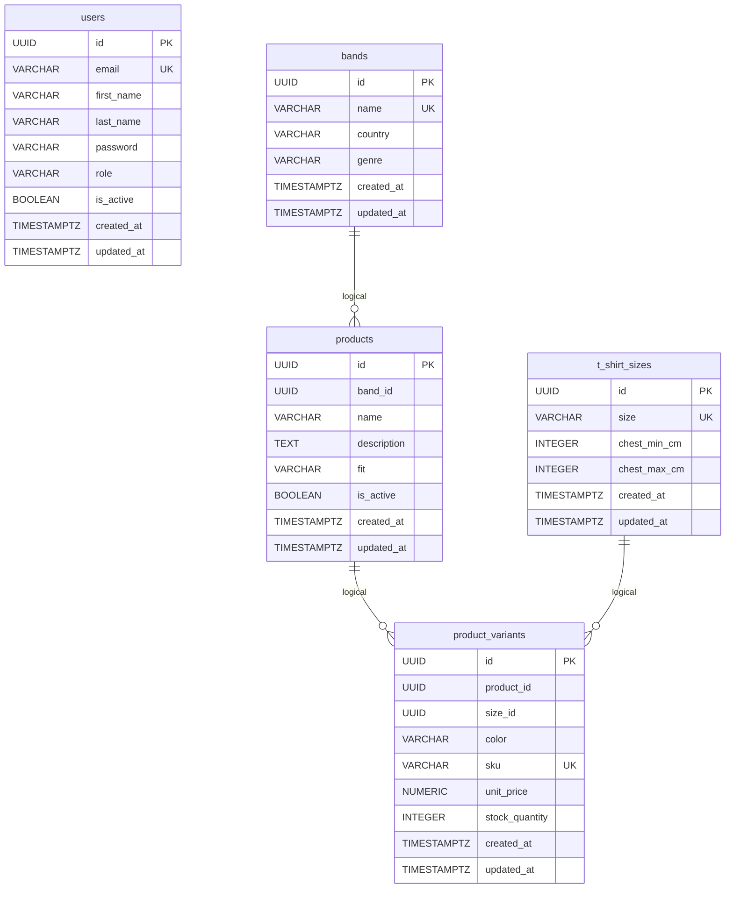
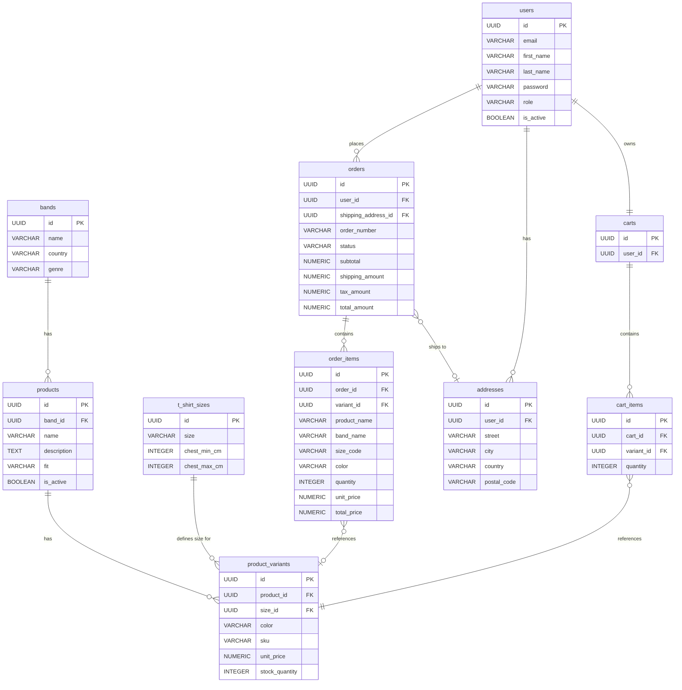

# E-Commerce Database Schema Reference

This document reflects the current schema based on implemented feature entities and applied Alembic migrations.

Implemented entities/models:
- `user`
- `band`
- `t_shirt_size`
- `product`
- `product_variant`

Applied migrations:
- `43a57a0d9e2c_initial_schema.py`
- `a1b2c3d4e5f6_add_products_table.py`

## Conventions

- UUID primary keys (`id`) from shared base model.
- `created_at` and `updated_at` timestamps are present on implemented models.
- Product catalog is modeled for metal-band t-shirts using base product + variants.

## Current ERD (Implemented)

Note: relationships above are logical/domain-level. Current migrations create indexed UUID reference columns but do not yet define explicit foreign key constraints for `products.band_id`, `product_variants.product_id`, and `product_variants.size_id`.

## Implemented Tables (Accurate as of Current Migrations)

### `users`

Source: `user` feature (`UserEntity`, `UserModel`), migration `43a57a0d9e2c`.

| Column | Type | Constraints |
|---|---|---|
| `id` | UUID | PK |
| `email` | VARCHAR(255) | NOT NULL, UNIQUE |
| `first_name` | VARCHAR(50) | NOT NULL |
| `last_name` | VARCHAR(50) | NOT NULL |
| `password` | VARCHAR(60) | NOT NULL |
| `role` | VARCHAR(8) | NOT NULL |
| `is_active` | BOOLEAN | nullable |
| `created_at` | TIMESTAMPTZ | NOT NULL |
| `updated_at` | TIMESTAMPTZ | NOT NULL |

Indexes:
- `ix_users_email`

### `bands`

Source: `band` feature (`BandEntity`, `BandModel`), migration `a1b2c3d4e5f6`.

| Column | Type | Constraints |
|---|---|---|
| `id` | UUID | PK |
| `name` | VARCHAR(150) | NOT NULL, UNIQUE |
| `country` | VARCHAR(100) | nullable |
| `genre` | VARCHAR(100) | nullable |
| `created_at` | TIMESTAMPTZ | NOT NULL |
| `updated_at` | TIMESTAMPTZ | NOT NULL |

### `t_shirt_sizes`

Source: `t_shirt_size` feature (`TShirtSizeEntity`, `TShirtSizeModel`), migration `a1b2c3d4e5f6`.

| Column | Type | Constraints |
|---|---|---|
| `id` | UUID | PK |
| `size` | VARCHAR(10) | NOT NULL, UNIQUE |
| `chest_min_cm` | INTEGER | nullable |
| `chest_max_cm` | INTEGER | nullable |
| `created_at` | TIMESTAMPTZ | NOT NULL |
| `updated_at` | TIMESTAMPTZ | NOT NULL |

### `products`

Source: `product` feature (`ProductEntity`, `ProductModel`), migration `a1b2c3d4e5f6`.

| Column | Type | Constraints |
|---|---|---|
| `id` | UUID | PK |
| `band_id` | UUID | nullable, indexed |
| `name` | VARCHAR(150) | NOT NULL |
| `description` | TEXT | nullable |
| `fit` | VARCHAR(20) | NOT NULL |
| `is_active` | BOOLEAN | NOT NULL, default true |
| `created_at` | TIMESTAMPTZ | NOT NULL |
| `updated_at` | TIMESTAMPTZ | NOT NULL |

Indexes:
- `ix_products_band_id`

### `product_variants`

Source: `product_variant` feature (`ProductVariantEntity`, `ProductVariantModel`), migration `a1b2c3d4e5f6`.

| Column | Type | Constraints |
|---|---|---|
| `id` | UUID | PK |
| `product_id` | UUID | NOT NULL, indexed |
| `size_id` | UUID | NOT NULL, indexed |
| `color` | VARCHAR(50) | NOT NULL, default `black` |
| `sku` | VARCHAR(50) | NOT NULL, UNIQUE |
| `unit_price` | NUMERIC(12,2) | NOT NULL |
| `stock_quantity` | INTEGER | NOT NULL, default 0 |
| `created_at` | TIMESTAMPTZ | NOT NULL |
| `updated_at` | TIMESTAMPTZ | NOT NULL |

Additional unique constraint:
- `UNIQUE (product_id, size_id, color)` via `uq_product_variant`

Indexes:
- `ix_product_variants_product_id`
- `ix_product_variants_size_id`

## Planned Structure (Not Yet Applied)

The following tables were part of the broader schema design but are not represented by current feature entities/migrations yet:

- `categories`
- `addresses`
- `carts`
- `cart_items`
- `orders`
- `order_items`
- `payments`

### Planned Table Definition: `orders`

Purpose:
- Stores customer order headers and monetary totals.
- Keeps checkout lifecycle state.

Recommended columns:

| Column | Type | Constraints |
|---|---|---|
| `id` | UUID | PK |
| `user_id` | UUID | NOT NULL, indexed (FK to `users.id`) |
| `shipping_address_id` | UUID | nullable, indexed (FK to `addresses.id`) |
| `order_number` | VARCHAR(30) | NOT NULL, UNIQUE |
| `status` | VARCHAR(20) | NOT NULL, default `pending` |
| `subtotal` | NUMERIC(12,2) | NOT NULL, CHECK (`subtotal >= 0`) |
| `shipping_amount` | NUMERIC(12,2) | NOT NULL, default 0, CHECK (`shipping_amount >= 0`) |
| `tax_amount` | NUMERIC(12,2) | NOT NULL, default 0, CHECK (`tax_amount >= 0`) |
| `total_amount` | NUMERIC(12,2) | NOT NULL, CHECK (`total_amount >= 0`) |
| `created_at` | TIMESTAMPTZ | NOT NULL |
| `updated_at` | TIMESTAMPTZ | NOT NULL |

Recommended status values:
- `pending`, `paid`, `shipped`, `delivered`, `cancelled`

### Planned Table Definition: `order_items`

Purpose:
- Stores immutable line items at purchase time.
- Links to `product_variants` while preserving snapshot values for historical consistency.

Recommended columns:

| Column | Type | Constraints |
|---|---|---|
| `id` | UUID | PK |
| `order_id` | UUID | NOT NULL, indexed (FK to `orders.id`) |
| `variant_id` | UUID | nullable, indexed (FK to `product_variants.id`) |
| `product_name` | VARCHAR(180) | NOT NULL |
| `band_name` | VARCHAR(150) | NOT NULL |
| `size_code` | VARCHAR(10) | NOT NULL |
| `color` | VARCHAR(50) | NOT NULL |
| `quantity` | INTEGER | NOT NULL, CHECK (`quantity > 0`) |
| `unit_price` | NUMERIC(12,2) | NOT NULL, CHECK (`unit_price >= 0`) |
| `total_price` | NUMERIC(12,2) | NOT NULL, CHECK (`total_price >= 0`) |
| `created_at` | TIMESTAMPTZ | NOT NULL |
| `updated_at` | TIMESTAMPTZ | NOT NULL |

Notes:
- `variant_id` can be nullable so historical order rows remain valid if a variant is archived/deleted later.
- `product_name`, `band_name`, `size_code`, and `color` should be stored as snapshots and not recalculated from current catalog state.

When these are implemented, they should follow the current project structure:

- Domain entity in `src/app/features/<feature>/domain/entities/`
- SQLAlchemy model in `src/app/features/<feature>/infrastructure/models/`
- Alembic migration creating the table and indexes

## Notes

- The product model is accurate for metal t-shirt cataloging: `bands` + `products` + `t_shirt_sizes` + `product_variants`.
- If stricter relational integrity is required now, add foreign key constraints in a new migration for:
  - `products.band_id -> bands.id`
  - `product_variants.product_id -> products.id`
  - `product_variants.size_id -> t_shirt_sizes.id`

---

## Entity Relationship Diagram

> Solid relationships are implemented. Entities shown under [Planned Structure](#planned-structure-not-yet-applied) (`orders`, `order_items`, `addresses`, `carts`, `cart_items`) represent the intended full domain model.
